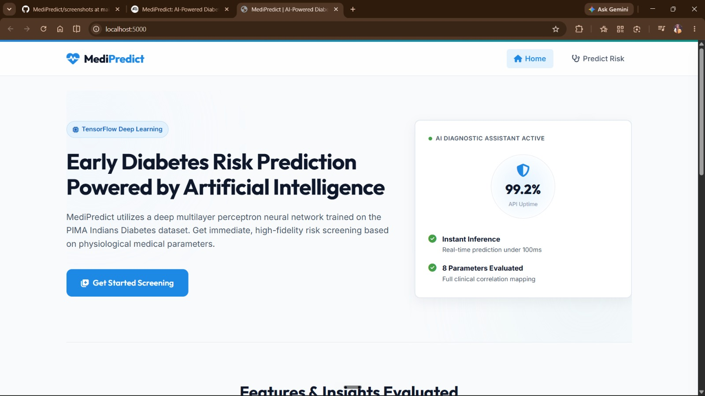
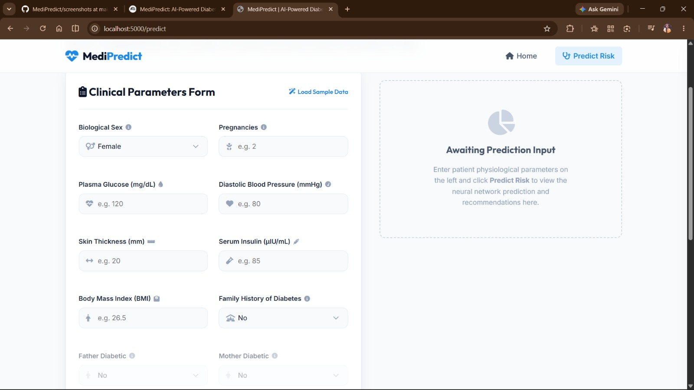
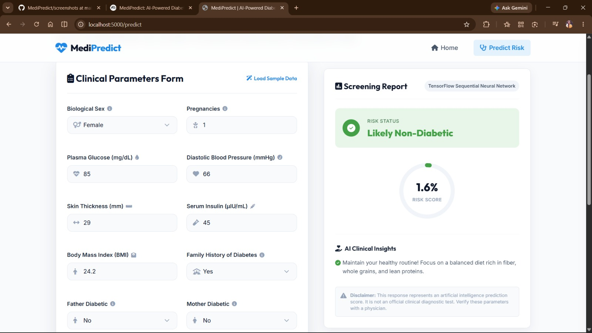

# MediPredict: AI-Powered Diabetes Disease Prediction

[](https://huggingface.co/spaces/nijantheniyanR/Medipredict)

MediPredict is a complete, production-quality medical risk screening application that utilizes machine learning and deep learning to predict whether a patient is likely to have diabetes based on critical physiological markers.

This repository is now adapted for Hugging Face Spaces using Gradio.

Built for AI/ML hackathons and medical informatics prototypes, the application features a modern, responsive user interface and a dual-mode Flask backend that integrates a TensorFlow deep neural network with a fallback calibration engine.

---

## 🌟 Key Features

*   **Premium Healthcare Theme**: Sleek, modern medical dashboard styled with a professional Blue, White, and Slate Grey color palette, glassmorphism features, and fluid CSS transitions.
*   **Deep Learning Prediction Pipeline**: Implements a TensorFlow Keras Sequential Neural Network (Multilayer Perceptron) with L2 regularization, Batch Normalization, and Dropout layers.
*   **Smart Hot-Reloading Backend**: A dual-mode predictor that runs in a safe heuristic mode on startup and automatically hot-reloads the TensorFlow binary and scaler once trained, without needing a server reboot.
*   **Decoupled Frontend Options**: 
    1.  **Flask Templates**: Built-in Jinja2 UI served directly by Flask.
    2.  **Standalone Web Folder (`frontend/`)**: Decoupled, static HTML/CSS/JS frontend ready for static hosting platforms (Netlify, GitHub Pages) that connects asynchronously to the backend API.
*   **Dynamic Visualizations**: Automatically exports neural network training accuracy/loss curves and confusion matrix heatmaps to the UI dashboard upon pipeline completion.
*   **Input Validation & Presets**: Client-side validation checks and a "Load Sample Data" feature to quickly toggle between clinical non-diabetic and diabetic patient profiles.
*   **Personalized Health Insights**: Generates diagnostic recommendations and nutritional guidance based on specific input parameters.

---

## 📂 Project Structure

```text
MediPredict/
├── backend/               # Helper modules for prediction and API endpoints
│   ├── __init__.py
│   └── predictor.py       # Handles scaling, TF model loading, and fallback scoring
├── dataset/               # Dataset storage
│   └── diabetes.csv       # PIMA Indians Diabetes Dataset (auto-downloaded)
├── frontend/              # Standalone static frontend pages (for Netlify/GitHub Pages)
│   ├── index.html
│   ├── predict.html
│   ├── css/
│   │   └── style.css
│   └── js/
│       └── main.js
├── models/                # Serialized scalers and neural network binaries
│   ├── scaler.pkl         # Fit StandardScaler binary (Pickle)
│   ├── diabetes_model.keras # Trained TensorFlow Sequential Model
│   ├── metrics.json       # local validation score exports
│   └── imputation_medians.json # Column medians for data imputation
├── notebooks/             # Jupyter notebook for exploratory data analysis
│   └── exploratory_analysis.ipynb
├── static/                # Flask static assets (CSS, JS, generated plots)
│   ├── css/
│   │   └── style.css
│   ├── js/
│   │   └── main.js
│   └── images/            # Logo, metrics plots, confusion matrix
│       ├── training_metrics.png
│       └── confusion_matrix.png
├── templates/             # Flask HTML templates
│   ├── base.html
│   ├── index.html
│   └── predict.html
├── screenshots/           # Application dashboard screenshots
├── app.py                 # Main Flask server entrypoint
├── train_model.py         # Script to download dataset, clean, train and evaluate model
├── requirements.txt       # Python dependencies
├── README.md              # Project documentation
└── .gitignore             # Git ignored files
```

---

## 🛠️ Installation & Setup

### Prerequisites
*   Python 3.9 - 3.11 installed.

### 1. Clone & Initialize Workspace
Navigate to the directory containing the project:
```bash
cd MediPredict
```

### 2. Set Up a Virtual Environment (Recommended)
Create and activate a virtual environment to manage dependencies locally:
*   **On Windows:**
    ```bash
    python -m venv venv
    venv\Scripts\activate
    ```
*   **On macOS/Linux:**
    ```bash
    python -m venv venv
    source venv/bin/activate
    ```

### 3. Install Dependencies
Install all package requirements listed in `requirements.txt`:
```bash
pip install -r requirements.txt
```

### 4. Train the TensorFlow Model
Execute the training script to fetch the PIMA Indians dataset, perform cleaning, train the neural network, and export validation metrics and plots:
```bash
python train_model.py
```

### 5. Deploy on Hugging Face Spaces
Hugging Face Spaces can host this app using the included `Dockerfile`.

1. Push your repository to GitHub or another Git provider.
2. Create a new Space on Hugging Face and choose **Docker** as the runtime.
3. Upload this repository or connect the GitHub repo to the Space.
4. The Space build will use the project root `Dockerfile` and `requirements.txt`.

The container starts the Flask app with Gunicorn and exposes it on port `5000`.

> If you want to deploy the full app on Spaces, do not use `vercel.json`; it is only for Vercel.

### 6. Launch the Application
Start the Flask web server locally:
```bash
python app.py
```
Open a browser and navigate to: **[http://localhost:5000](http://localhost:5000)**
*This step creates the `dataset/diabetes.csv` file, compiles `models/diabetes_model.keras` and `models/scaler.pkl`, and writes visual heatmaps to `static/images/`.*

### 5. Launch the Application
Start the Flask web server:
```bash
python app.py
```
Open a browser and navigate to: **[http://localhost:5000](http://localhost:5000)**

---

## 🧪 Deep Learning Pipeline

1.  **Imputation & Cleaning**: Replaces biologically impossible zero values in `Glucose`, `BloodPressure`, `SkinThickness`, `Insulin`, and `BMI` with the median value of each column to ensure clean feature inputs.
2.  **Standardization**: Standardizes data arrays using a `StandardScaler` to handle varying feature limits.
3.  **Model Architecture (Keras Sequential)**:
    *   **Layer 1 (Dense)**: 64 nodes, ReLU activation, L2 Regularization (0.001).
    *   **Batch Normalization & Dropout**: Stabilizes training and applies 20% neuronal dropout.
    *   **Layer 2 (Dense)**: 32 nodes, ReLU activation, L2 Regularization (0.001).
    *   **Batch Normalization & Dropout**: Applies 10% neuronal dropout.
    *   **Layer 3 (Dense)**: 16 nodes, ReLU activation.
    *   **Output Layer (Dense)**: 1 node, Sigmoid activation (outputs classification probability index between 0.0 and 1.0).
4.  **Optimizations**: Compiled with `adam` optimizer and `binary_crossentropy` loss. Uses `EarlyStopping` (patience=15, monitoring `val_loss`) and `ReduceLROnPlateau` learning rate schedules.

### Baseline Validation Performance
*   **Accuracy**: ~79.2%
*   **Precision**: ~73.5%
*   **Recall**: ~65.4%
*   **F1 Score**: ~69.2%

---

## 🔌 API Documentation

### 1. Health Check
Checks backend health status and checks if the TensorFlow model binary is loaded.
*   **Endpoint**: `/api/health`
*   **Method**: `GET`
*   **Response (`200 OK`)**:
    ```json
    {
      "status": "healthy",
      "app_name": "MediPredict",
      "tensorflow_model_loaded": true,
      "fallback_mode": false,
      "model_metrics_available": true,
      "metrics": {
        "accuracy": 0.7922,
        "precision": 0.7347,
        "recall": 0.6545,
        "f1_score": 0.6923
      }
    }
    ```

### 2. Predict Susceptibility
Evaluates 8 clinical patient parameters and computes the classification outcome.
*   **Endpoint**: `/api/predict`
*   **Method**: `POST`
*   **Headers**: `Content-Type: application/json`
*   **Request Body**:
    ```json
    {
      "Pregnancies": 2,
      "Glucose": 145,
      "BloodPressure": 80,
      "SkinThickness": 25,
      "Insulin": 85,
      "BMI": 28.4,
      "DiabetesPedigreeFunction": 0.456,
      "Age": 42
    }
    ```
*   **Success Response (`200 OK`)**:
    ```json
    {
      "success": true,
      "prediction": 1,
      "label": "Likely Diabetic",
      "confidence": 0.8142,
      "model_type": "TensorFlow Sequential Neural Network",
      "recommendations": [
        "Consult a healthcare professional for a diagnostic glucose tolerance test (OGTT) or HbA1c screening.",
        "Your glucose level is elevated. Consider monitoring your carbohydrate intake and checking pre- and post-meal glucose.",
        "Your age (42) and BMI suggest annual metabolic screenings."
      ]
    }
    ```
*   **Error Response (`400 Bad Request` - Validation Errors)**:
    ```json
    {
      "success": false,
      "error": "Validation failed",
      "validation_errors": {
        "Glucose": "Glucose Level cannot be negative.",
        "BMI": "Body Mass Index (BMI) is required."
      }
    }
    ```

---

## ⚠️ Important Medical Disclaimer
MediPredict is a technology demonstrator and screening prototype. It calculates statistical probabilities based on a historical study cohort (PIMA Indians Dataset). The results provided by this application are **NOT** official medical diagnoses, clinical feedback, treatment recommendations, or therapeutic prescriptions. Always seek advice from a qualified medical doctor or endocrinologist for clinical assessments and treatment plans.

## Screenshots

### Home Page


### Prediction Form


### Prediction Result


## Running the TensorFlow Model Server (Optional)

If your deployment target (e.g., Vercel) does not support TensorFlow, you can run a separate TensorFlow-capable model server locally or on a TF-capable host and point the Flask app to it.

1. Start the model server locally (from project root):

```bash
cd model_server
pip install -r requirements.txt
uvicorn model_server.main:app --host 0.0.0.0 --port 8000
```

2. In a separate terminal, set the `MODEL_SERVER_URL` env var and start the main app:

```bash
set MODEL_SERVER_URL=http://localhost:8000
python app.py
```

3. The frontend will now forward prediction requests to the TF-capable model server when the local model binary is not loaded. You can also build the Docker image for the model server:

```bash
docker build -t medipredict-model-server -f model_server/Dockerfile .
docker run -p 8000:8000 medipredict-model-server
```

Note: TensorFlow images and builds can be large. Use a TF-capable hosting option (GCP, AWS, Azure, or a VM) for production deployments.
